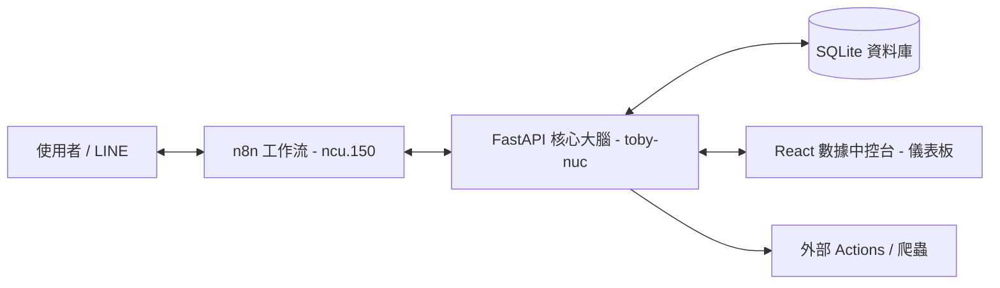

# n8n 自動化整合工廠 (n8n Automation Factory)


這是一個企業級的自動化整合系統，結合了 **n8n** 的工作流編排能力、**FastAPI** 的高效邏輯處理，以及 **React (Tailwind v4)** 的現代化數據中控台。

## 🚀 系統架構

本專案採用分散式邏輯架構，將「自動化流程」與「核心業務邏輯」分離：



- **n8n (ncu-150)**: 負責通訊介面與節點觸發。
- **FastAPI Backend (toby-nuc)**: 集中處理業務邏輯、Lead 追蹤與狀態機。
- **React Frontend**: 提供 Premium 視覺質感的數據中控台，支援即時日誌串流。
- **SQLite**: 本地高效存取轉化線索與互動記錄。

## 🛠️ 技術棧

| 組件 | 技術 | 說明 |
| :--- | :--- | :--- |
| **工作流** | n8n | 視覺化節點調度與外部 API 整合 |
| **後端** | FastAPI / Python 3.12 | 高性能非同步大腦，即時 WebSocket 支援 |
| **資料庫** | SQLAlchemy / SQLite | 輕量且強大的本地數據中心 |
| **前端** | React 19 / Vite 8 | 現代化開發環境 |
| **樣式** | Tailwind CSS v4 / Framer Motion | 毛玻璃設計與流暢動畫體驗 |

## 📂 目錄結構

- `backend/`: FastAPI 應用程式核心，包含資料模型與 Bot 邏輯。
- `frontend/`: React 專案，包含即時監控儀表板。
- `actions/`: 獨立的腳本組件（如 Web Scraper）。
- `n8n_templates/`: 存放匯出的 n8n 工作流 (JSON)。
- `ai_notices/`: 專案實作計畫與進度紀錄。

## 🏁 快速啟動

### 1. 環境設定
複製 `.env.example` 並設定連線參數：
```bash
cp .env.example .env
```

### 2. 啟動後端
```bash
cd backend
pip install -r requirements.txt
python main.py
```
*預設運行於 `http://0.0.0.0:8000`*

### 3. 啟動前端
```bash
cd frontend
npm install
npm run dev
```
*預設訪問 `http://localhost:5173`*

## 🌟 核心功能

- ✅ **LINE Bot 邏輯控制中心**：不再將複雜邏輯寫在 n8n 節點中。
- ✅ **線索自動追蹤 (Lead Tracking)**：自動記錄每一位互動用戶。
- ✅ **即時日誌 (Live Trace)**：透過 WebSocket 監控系統的所有動作。
- ✅ **自動化控制台**：直接從網頁觸發 n8n 流程。

---

## 📅 開發進階

目前的實作進度請參考 [ai_notices/](file:///home/toymsi/documents/projects/n8n_factory/ai_notices/) 目錄下的 `walkthrough` 檔案。
