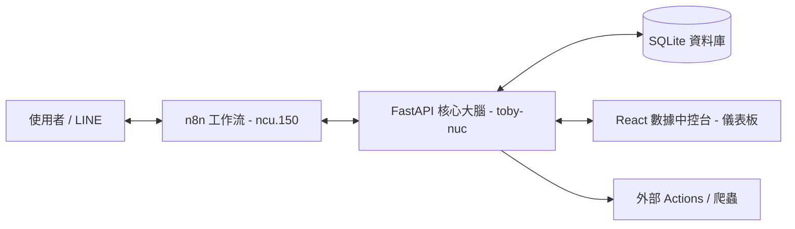

# n8n 自動化整合工廠 (n8n Automation Factory)


這是一個企業級的自動化整合系統，結合了 **n8n** 的工作流編排能力、**FastAPI** 的高效邏輯處理，以及 **React (Tailwind v4)** 的現代化數據中控台。

## 🚀 系統架構

本專案採用分散式邏輯架構，將「自動化流程」與「核心業務邏輯」分離：



- **n8n (ncu-150)**: 負責通訊介面與節點觸發。
- **FastAPI Backend (toby-nuc)**: 集中處理業務邏輯、Lead 追蹤與狀態機。
- **React Frontend**: 提供 Premium 視覺質感的數據中控台，支援即時日誌串流。
- **SQLite**: 本地高效存取轉化線索與互動記錄。

## 🛠️ 技術棧

| 組件 | 技術 | 說明 |
| :--- | :--- | :--- |
| **工作流** | n8n | 視覺化節點調度與外部 API 整合 |
| **後端** | FastAPI / Python 3.12 | 高性能非同步大腦，即時 WebSocket 支援 |
| **資料庫** | SQLAlchemy / SQLite | 輕量且強大的本地數據中心 |
| **前端** | React 19 / Vite 8 | 現代化開發環境 |
| **樣式** | Tailwind CSS v4 / Framer Motion | 毛玻璃設計與流暢動畫體驗 |

## 📂 目錄結構

- `backend/`: FastAPI 應用程式核心，包含資料模型與 Bot 邏輯。
- `frontend/`: React 專案，包含即時監控儀表板。
- `actions/`: 獨立的腳本組件（如 Web Scraper）。
- `n8n_templates/`: 存放匯出的 n8n 工作流 (JSON)。
- `ai_notices/`: 專案實作計畫與進度紀錄。

## 🏁 快速啟動 (One-Click Setup)

本專案支援一鍵啟動前後端，並自動完成 IP 同步與環境檢查。

### Linux / macOS
```bash
./run
```

### Windows (CMD/PowerShell)
```cmd
run.bat
```

> [!NOTE]
> 啟動前請確保已建立好 **Conda** 環境 (名稱為 `toby`) 並安裝 **Node.js**。若是第一次啟動，指令會自動安裝所需的 `node_modules`。

### 手動環境設定
1. **IP 同步 (選填)**：若 IP 變動，系統會自動處理，但您也可手動執行 `python backend/sync_n8n_ip.py`。
2. **Conda 環境**：`conda create -n toby python=3.12`
3. **設定檔**：複製 `.env.example` 並設定為 `.env`。

## 🌟 核心功能

- ✅ **LINE Bot 邏輯控制中心**：不再將複雜邏輯寫在 n8n 節點中。
- ✅ **線索自動追蹤 (Lead Tracking)**：自動記錄每一位互動用戶。
- ✅ **即時日誌 (Live Trace)**：透過 WebSocket 監控系統的所有動作。
- ✅ **自動化控制台**：直接從網頁觸發 n8n 流程。
- ✅ **LINE 訊息投放系統**：9 欄位訊息編輯器，支援 Flex Message 與定時群體發送。
- ✅ **📈 SQL 數據分析實驗室**：
    - **自定義查詢**：直接在儀表板執行 SQL 查詢。
    - **雙向對比**：支持 SQL1 vs SQL2 並列分析，自動計算成長率。
    - **AI 商業分析助理**：內建 `SQL Business Analyst` 核心技能，可透過對話協作將「商業活動需求」翻譯為「精準 SQL 指令」。
    - **小白防護**：自動欄截 `DELETE/DROP` 等危險指令，確保數據安全。

---

## 📅 開發進階

目前的實作進度請參考 [ai_notices/](file:///home/toymsi/documents/projects/n8n_factory/ai_notices/) 目錄下的 `walkthrough` 檔案。
