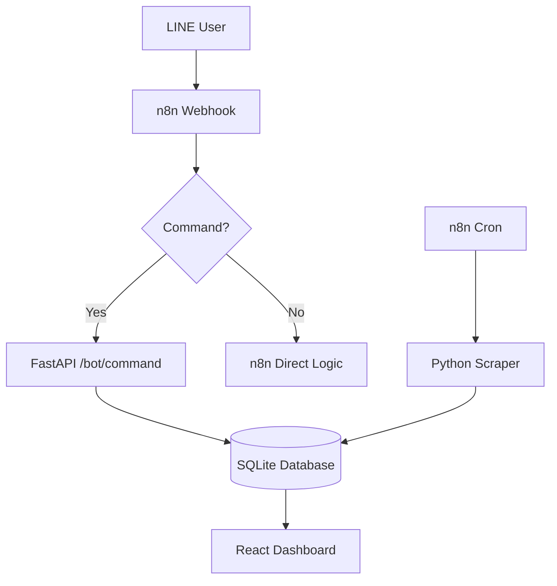

# n8n Factory - Enterprise Edition Walkthrough

We have evolved the **n8n Factory** into a robust **LINE Bot & Lead Management** platform. This system handles complex dialogue flows, automated scraping, and real-time visualization of your automated business processes.

## Key Features Implemented

### 1. Smart Bot Handler (Scenario 1 & 3)
- **Endpoint**: `POST /bot/command`
- **Dialogue State Machine**: Track user progress through multi-step conversations (e.g., `/winwin` command).
- **Lead Generation**: Automatically creates or updates leads in the database based on LINE interactions and text input.

### 2. Strategic Lead Management (Scenario 5)
- **Leads Dashboard**: A dedicated view to monitor your growing list of prospects.
- **Dynamic Status**: Track lead progression from `new` to `in-progress` and `completed`.
- **Metadata Storage**: Store custom captured information like "Interest" or "Industry" in a structured JSON format.

### 3. Automated Scraper & Scheduler (Scenario 2 & 4)
- **Scraper Service**: A standalone Python worker (`scraper.py`) that can be triggered by n8n to monitor web pages.
- **Task Tracking**: Monitor the status of your background tasks directly from the dashboard.

### 4. Advanced Analytics
- **Interaction Monitoring**: Visual charts of bot activity.
- **Performance Metrics**: Real-time stats on scraper accuracy and API latency.

## Architecture Diagram



## How to Test the Bot Logic

You can simulate a LINE Bot interaction using the following command (running in the `toby` environment):

```bash
# Simulate a /help command
curl -X POST http://localhost:8000/bot/command \
     -H "Content-Type: application/json" \
     -d '{"uid": "user_123", "username": "Toby", "message": "/help"}'
```

Check the **Live System Logs** on the dashboard to see the real-time response!

---

> [!IMPORTANT]
> **Database Location**: Your data is stored in `backend/data.db` (SQLite). This file is automatically created on first run.

> [!TIP]
> To add more bot commands, simply update the logic in `backend/main.py`. The dashboard will automatically reflect any new lead data captured.
